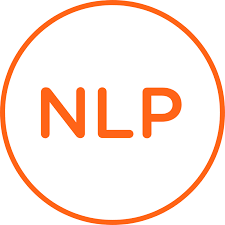
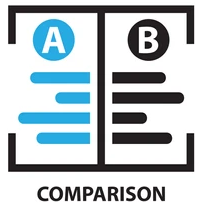

<h1>Hi, I'm Chi!  <a href="https://github.com/joshmadakor1](https://github.com/ChiNguyen27">Data scientist, NLP engineering</a>, <a href="https://www.linkedin.com/in/chi-nguyen-a612421b2/">Research Assistant/Ph.D. student</a>
 
 <!--  <a href="https://medium.com/@chiyenng2788">Medium member</a></h1> -->

 <!----------------------------------------------APPIED AI FOR WIRELESS NETWORKS PROJECTS ------------------------------------------------------>
  <h2>    Applied AI for  5G/6G Wireless Networks:</h2>
  
  <b>Deep learning for multi-frequency path loss model</b>
  - Publication: https://www.mdpi.com/1424-8220/21/15/5100
  - Code: Available soon 
  
  <b>Channel esitmation for 6G network </b>
   - Publication: under consideration of IEEE Transaction on Machine Learning and Network
  - Code: Available soon 
 
  <b>Radio-frequency electromagnetic field exposure </b>
   - Publication: ready to submit to IEEE Access
  - Code: Available soon 
 
 

 NOTE: This project belongs to a project funded by Ulster University, the code will be pubished after all publications are completed. 

  <!---------------------------------------------NLP PROJECTS--------------------------------------------------------------------------------->
 <h2>   NLP projects </h2>
 
 <b>  Text similarity </b>
  - [Project 1](Github code: Available soon)
  
  <b>Recommendation systems </b>
   - [Project 1](Github code: Available soon)
 <!---------------------------------------------SQL PROJECTS--------------------------------------------------------------------------------->
 <h2>   SQL </h2>
 
<b>Basic SQL </b>
   - [Project 1](Github code: Available soon)

 <!---------------------------------------------SOFTWARE DEVELOPMEMTS--------------------------------------------------------------------------------->
<h2>👨‍💻 Software Development Projects:</h2>
 
- <b>Intro to Data Structures and Algorithms (Udacy) </b>
  - [Data Structures and Algorithm Practice](Github code: availabe soon)
 
 <!---------------------------------------------ONLINE  COURSES --------------------------------------------------------------------------------->
<h2>  Course </h2>

- [Introduction to Git and GitHub]
- [Hyperparameter for machine learning, Udemy]
- [Machine Learning: Natural Language Processing in Python (V2), Udemy]
- [Recommender Systems and Deep Learning in Python, Udemy]
- [Intro to Data Structures and Algorithms, Udacy] 

<h2> 🤳 Connect with me:</h2>

<!--[][youtube]-->
[][twitter]
[][linkedin]
<!--[][instagram]-->

[twitter]: https://twitter.com/NguyenYenChi3
<!--[youtube]: https://www.youtube.com/c/joshmadakor -->
<!-- instagram]: https://www.instagram.com/joshmadakor/  -->
[linkedin]: https://www.linkedin.com/in/chi-nguyen-a612421b2/

<!--
**joshmadakor1/joshmadakor1** is a ✨ _special_ ✨ repository because its `README.md` (this file) appears on your GitHub profile.

Here are some ideas to get you started:

- 🔭 I’m currently working on ...
- 🌱 I’m currently learning ...
- 👯 I’m looking to collaborate on ...
- 🤔 I’m looking for help with ...
- 💬 Ask me about ...
- 📫 How to reach me: ...
- 😄 Pronouns: ...
- ⚡ Fun fact: ...
-->
